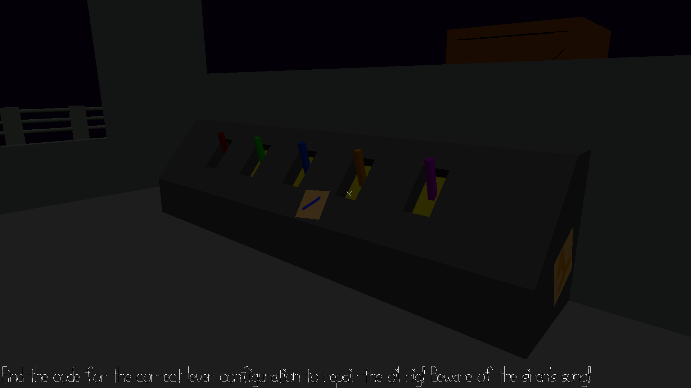

# Night Shift on the Oil Rig

### Author: Matthew Largo

### A code-finding, repair-the-object, puzzle-ish game, but you are a night shift worker on an oil rig who must fulfill his objective without being claimed by the siren's alluring song.

## How To Play:

### Controls:

WASD - Move

Mouse motion - Look around

L-Shift - Sprint

F - Interact

Q - Quit the game

R - Restart the game

Space - Resist the Siren's song

Escape - Ungrab the mouse

### Objective:

You were called in last minute to repair the oil rig which seems to have mysteriously malfunctioned. You cannot seem to remember the necessary lever configuration for this repair off the top of your head, but you and your co-workers placed hints around the rig in the event that would happen! Look around and determine what the appropriate configuration is! DO NOT give in to the siren's song.

The siren will attempt to lure you in every so often with her song. Spam the spacebar to resist the it.

    
 Hints 

- Each lever has its own distinct color.

- A lever in the upmost position is in its first state.

This game was built with [NEST](NEST.md).
